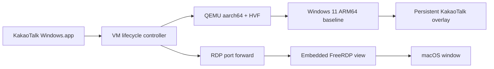

# Architecture

## High-Level Shape

## Core Runtime

The app launches QEMU with:

- Windows 11 ARM64 baseline qcow2 as backing image
- persistent KakaoTalk qcow2 overlay as writable disk
- UEFI firmware
- user-mode NAT
- host port forward to guest RDP `3389`
- optional config disk for first-run scripts

The overlay is not disposable. It stores:

- KakaoTalk installation
- KakaoTalk login/session data
- Windows per-user state
- small runtime preferences

## Difference From macSandbox

macSandbox is designed as a disposable Windows Sandbox replacement:

- create new overlay every run
- run arbitrary `.wsb` config
- discard all changes on exit
- expose Windows desktop through embedded RDP

This project is a dedicated app appliance:

- one persistent overlay
- one target app
- no `.wsb`
- no generic sandbox controls
- no automatic cleanup of app state

## Main Components

### App Shell

SwiftUI or AppKit macOS application.

Responsibilities:

- start/stop VM
- show boot state
- host RDP view
- send quit/shutdown command
- report setup errors

### VM Controller

Responsibilities:

- locate QEMU and firmware
- ensure baseline exists
- ensure persistent overlay exists
- launch QEMU
- reserve local RDP port
- terminate QEMU on app quit

### Setup Controller

Responsibilities:

- detect whether KakaoTalk is installed in the overlay
- run installer on first setup
- configure auto-start
- optionally configure Windows shell/taskbar behavior

### RDP View

Two possible implementations:

1. External `sdl-freerdp` for early prototype.
2. Embedded FreeRDP view copied/adapted from macSandbox for final app-like UX.

Embedded RDP is preferred for the final product because it avoids a second app window.
